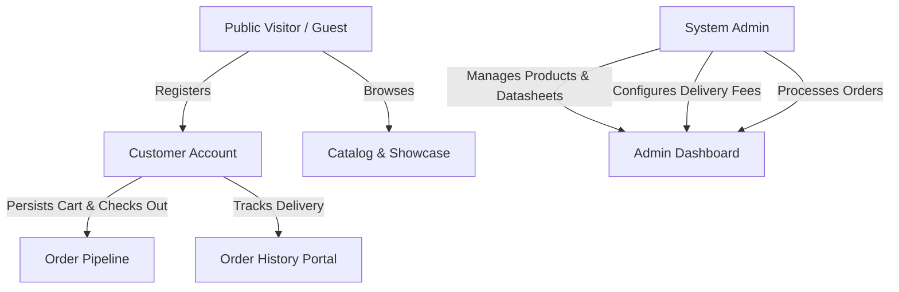
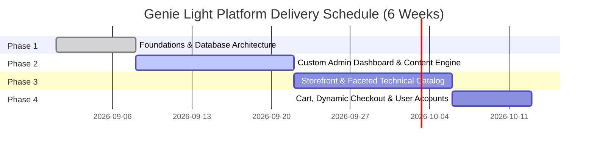

# Genie Light E-Commerce Platform & Product Showcase
## AI-Ready Master Project Specification & Technical Blueprint

> **Document Type:** Master System Specification / AI Context Blueprint  
> **Target Audience:** AI Models, Autonomous Coding Agents, Full-Stack Engineers, Product Managers  
> **Project Name:** Genie Light E-Commerce Platform & Technical Catalog Showcase  
> **Client:** Eng. Ahmed Mostafa (Genie Light)  
> **Lead Developer / Author:** Remon Hany (Full-Stack Web Developer)  
> **Project Date:** August 2026  
> **Estimated Duration:** 1.5 Months (6 Weeks / Sprint-Based Delivery)  
> **Status:** Active / Pre-Implementation Phase  

---

## Table of Contents
1. [Executive Summary & Company Background](#1-executive-summary--company-background)
2. [Platform Goals & Core Value Proposition](#2-platform-goals--core-value-proposition)
3. [User Roles & Functional Requirements](#3-user-roles--functional-requirements)
4. [Data Architecture & Parent/Sub-Product Model](#4-data-architecture--parentsub-product-model)
5. [Prisma Database Schema Specification](#5-prisma-database-schema-specification)
6. [Monorepo Codebase & Directory Structure](#6-monorepo-codebase--directory-structure)
7. [System Architecture & Technology Stack](#7-system-architecture--technology-stack)
8. [Phased Implementation Roadmap (Phases 1–4)](#8-phased-implementation-roadmap-phases-14)
9. [Design System, Brand Identity & UI/UX Standards](#9-design-system-brand-identity--uiux-standards)
10. [Real Project Case Studies (Showcase Data)](#10-real-project-case-studies-showcase-data)
11. [API Contracts & Core Endpoints](#11-api-contracts--core-endpoints)
12. [Financial Budget, Milestones & Open Questions](#12-financial-budget-milestones--open-questions)
13. [AI Agent Prompt Instructions & Constraints](#13-ai-agent-prompt-instructions--constraints)

---

## 1. Executive Summary & Company Background

### 1.1 Who We Are
**Genie Light** is a premier provider of commercial, architectural, industrial, and specialized lighting and electrical solutions. Founded in **2011**, Genie Light has established a formidable presence in Egypt, the Middle East, and across the African continent, supplying mega-infrastructure developments, airports, tunnel networks, petroleum sites, universities, and commercial complexes.

- **Founding Year:** 2011
- **Corporate Head Office:** 40 Roshdy Street, Downtown, Cairo, Egypt
- **Commercial Showroom:** 20 El-Gomhoria Street, Downtown, Cairo, Egypt
- **Phone Lines:** `+20 101 479 4281` | `+20 102 453 8960`
- **Email:** `info@genielight-co.com`
- **Website:** [https://genielight-co.com](https://genielight-co.com)
- **Official Distributor & Partner Brands:** Philips, Schneider Electric, OSRAM, Ledvance, Tridonic, Fumagalli, Elsewedy Engineering Industries, Olympia Electronics, TCL, VS Lighting Solutions, JCC Leviton, Eaton, MEM, Thorn, Crabtree, GE.
- **Key Corporate Clients:** Cairo International Airport, American University in Cairo (AUC), German University in Cairo (GUC), New Alamein University (AIU), Sphinx International Airport, Alamein International Airport, Cairo Metro Line 3, Petrojet, Vodafone, Oracle, Orascom Development, Cleopatra Group, Mall of Arabia, Nile Plaza, Bibliotheca Alexandrina, Oasis Hotel, SunRise Resorts.

### 1.2 Mission & Vision
- **Mission:** Deliver innovative, high-efficiency, sustainable lighting and electrical solutions that elevate spaces and operational efficiency through advanced smart controls, durable materials, and engineering excellence.
- **Vision:** Set industry standards across Egypt and the MENA region in architectural aesthetics, photometrics, energy savings, and turn-key infrastructure illumination.

---

## 2. Platform Goals & Core Value Proposition

The Genie Light platform is a hybrid **B2B / B2C Technical Product Showcase and E-Commerce Application**. It addresses a critical problem in the architectural lighting industry: **lighting fixtures are highly technical, multi-variant products that cannot be properly represented by simple single-item e-commerce listings**.

### Key Pillars
1. **Parent & Sub-Product Hierarchy:** Present luminaire families as unified parent products with clean, structured child variations (differing by wattage, luminous flux, beam angle, CCT, IP rating, mounting style).
2. **Faceted Technical Search Engine:** Enable lighting consultants, electrical contractors, and architects to filter by rigorous photometric attributes (lumens, wattage, color temperature, brand, voltage, IP rating) alongside price and category.
3. **Integrated Technical Datasheet Repository:** Seamless access to downloadable PDF technical specifications, photometric curves, and mounting diagrams directly tied to each variant SKU.
4. **Verified Infrastructure Showcase:** Dedicated case study engine detailing high-profile national projects with technical challenges, engineered solutions, and photometric standards achieved.
5. **Back-Office Management:** A purpose-built Next.js administrative dashboard giving complete control over catalog taxonomy, child variant matrix generation, PDF datasheet storage, dynamic governorate shipping rates, and order fulfillment states.

---

## 3. User Roles & Functional Requirements

The platform strictly isolates three user archetypes with granular access control:



### 3.1 Role 1: Guest (Unregistered Public Visitor)
- **Public Navigation:** Access Home, About Us, Contact Us, Previous Projects Showcase, and Catalog.
- **Faceted Product Search:** Search and filter by category (Indoor, Outdoor, Drivers, Emergency, Industrial), sub-category (Downlights, Floodlights, Track Lights, High Bays, Linear), brand/family, wattage range, luminous flux range, CCT, IP rating, and keyword.
- **Detailed Product Examination:** View parent overview, high-resolution photo galleries, select sub-product variants dynamically, review spec sheets, and download technical PDF datasheets.
- **Project Case Studies:** Read project retrospectives (challenges, solutions, photometric achievements, photo galleries).
- **Authentication:** Ability to register with Name, Email, Phone, Company (optional), and Password.

### 3.2 Role 2: User (Registered Store Customer / Contractor)
- **Persistent Cart Engine:** Add specific sub-product SKUs to cart; items persist across sessions and devices (synchronized via database for logged-in users, with localStorage fallback).
- **Checkout Workflow:** Enter delivery address (Governorate, City, Detailed Address, Contact Phone), review dynamically calculated delivery rates, and submit orders.
- **Order Lifecycle Tracking:** Real-time visibility into past and active orders with lifecycle states:
  - `PENDING` (Order submitted, awaiting back-office confirmation)
  - `CONFIRMED` (Stock allocated, invoice created)
  - `PROCESSING` (Packed and prepared for dispatch)
  - `SHIPPED` (In transit with courier/delivery fleet)
  - `DELIVERED` (Successfully delivered to customer)
  - `CANCELLED` (Voided by admin or customer request)
- **Customer Profile:** Manage multiple shipping addresses, update contact details, and view past invoices/datasheets.

### 3.3 Role 3: Admin (Genie Light Platform Owner)
- **Product & Variation Control:** 
  - Create, update, archive parent products with rich descriptions, key features, and gallery images.
  - Manage sub-product variant matrix: assign power (W), luminous flux (lm), CCT (K), beam angle, CRI, IP rating, dimensions, other details/notes, SKU code, inventory, and individual variant pricing.
- **Datasheet & Media Management:** Upload PDF datasheets to MinIO object storage, associate PDFs to parent or child products, and manage hero/catalog imagery.
- **Category & Brand Management:** Create and organize hierarchical categories, sub-categories, and partner brand profiles (Philips, Schneider, Osram, etc.).
- **Order Fulfillment:** Filter and view all customer orders, inspect line items and customer notes, update delivery statuses, and add internal fulfillment notes.
- **Dynamic Delivery Fee Engine:** Configure delivery rates by Egyptian governorate/city (e.g., Greater Cairo flat rate, Alexandria, Delta, Upper Egypt, Red Sea zones).
- **Project Showcase CMS:** Publish new project case studies, upload job-site photography, record technical challenges and engineered lighting solutions.
- **Customer Directory:** Inspect registered user profiles, contact information, order volumes, and lifetime value.

### 3.4 Role 4: Data Entry Specialist (Catalog Operations & Technical Spec Specialist)
A dedicated, restricted back-office role designed specifically for technical catalog population (aligned with the 550 L.E. / 30 sub-products milestone contract).

#### A. Permitted Dashboard Capabilities:
- **Product Catalog Management:** Create and edit Parent Products (title, description, brand, category, application tags).
- **Child Variant Matrix Builder:** Generate and edit Sub-Products (Wattage, Lumens, CCT Kelvin, CRI, Beam Angle, IP rating, Dimensions, Other Details, Price, Stock).
- **Datasheet & Asset Uploader:** Upload technical PDF datasheets to MinIO and bind them directly to corresponding sub-products; upload and order product studio photographs.
- **Batch Progress Tracker:** A dedicated widget in the dashboard header displaying: **"Current Batch: X / 30 Sub-Products Completed"** to audit and track delivery against the 550 L.E. milestone billing threshold.

#### B. Strict Dashboard Security Boundaries (RBAC Constraints):
- **NO Access to Financial & Order Data:** The Data Entry role is completely blocked from accessing `/admin/orders`, revenue reports, and customer order histories (returns `403 Forbidden`).
- **NO Access to Customer PII:** Cannot access `/admin/users` or view registered customer names, phone numbers, and addresses.
- **NO Access to Store Settings:** Cannot modify `/admin/delivery-fees`, payment gateway configurations, or system credentials.
- **No Hard Deletes:** Cannot permanently delete parent products or categories; can only set status to `DRAFT` or `INACTIVE` for Admin review.

#### C. Dashboard Operational & Validation Rules for Data Entry:
1. **Mandatory Photometric Data:** Every sub-product must have at least `wattage`, `luminousFlux`, `colorTemperature`, and `ipRating` specified before it can be marked active.
2. **Mandatory PDF Datasheet Verification:** The dashboard must flag a visual warning if a sub-product is saved without a linked PDF datasheet URL.
3. **Standardized SKU Formatting:** The system automatically suggests or validates SKU codes following the pattern: `[BRAND_CODE]-[SERIES]-[WATTAGE]W-[CCT]K-[IP]` (e.g., `PH-BVP150-50W-4000K-IP65`).
4. **Image Standards:** Product imagery must be uploaded with minimum resolution 1200x1200px on clean white `#FFFFFF` or isolated transparent background, with max file size 2MB (enforced by client-side compression).

---

## 4. Data Architecture & Parent/Sub-Product Model

### 4.1 The Conceptual Model
Lighting fixtures operate on a **two-tier hierarchy**:

```
[PARENT PRODUCT]
  └── Name: "Philips SmartBright G3 LED Floodlight"
  └── Slug: "philips-smartbright-g3-floodlight"
  └── Brand: "Philips"
  └── Category: "Outdoor" -> "Floodlights"
  └── Description: General optical system overview, housing material, IP/IK certification
  └── Gallery Images: [render1.jpg, dimension_diagram.jpg, application.jpg]
  │
  ├── [SUB-PRODUCT VARIANT 1]
  │     ├── SKU: "BVP150-LED10-3000K-10W"
  │     ├── Power: 10W
  │     ├── Lumens: 950 lm
  │     ├── CCT: 3000K (Warm White)
  │     ├── Beam Angle: 110°
  │     ├── IP Rating: IP65
  │     ├── Price: 420 EGP
  │     └── PDF Datasheet: "datasheet_bvp150_10w.pdf"
  │
  ├── [SUB-PRODUCT VARIANT 2]
  │     ├── SKU: "BVP150-LED50-4000K-50W"
  │     ├── Power: 50W
  │     ├── Lumens: 4750 lm
  │     ├── CCT: 4000K (Neutral White)
  │     ├── Beam Angle: 110°
  │     ├── IP Rating: IP65
  │     ├── Price: 1,150 EGP
  │     └── PDF Datasheet: "datasheet_bvp150_50w.pdf"
  │
  └── [SUB-PRODUCT VARIANT 3]
        ├── SKU: "BVP150-LED100-6500K-100W"
        ├── Power: 100W
        ├── Lumens: 9500 lm
        ├── CCT: 6500K (Cool Daylight)
        ├── Beam Angle: 110°
        ├── IP Rating: IP65
        ├── Price: 2,100 EGP
        └── PDF Datasheet: "datasheet_bvp150_100w.pdf"
```

### 4.2 Standard Technical Specification Attributes
Every Sub-Product model supports these structured attributes:
- **`wattage`** (Float/Int, Watts, e.g., 10, 20, 50, 100, 200)
- **`luminousFlux`** (Int, Lumens, e.g., 800, 2400, 5000, 12000)
- **`efficacy`** (Float, lm/W, computed or specified)
- **`colorTemperature`** (Int, Kelvin, e.g., 2700, 3000, 4000, 5000, 6500)
- **`cri`** (Int, Color Rendering Index, e.g., 80, 90)
- **`beamAngle`** (String, e.g., "15°", "24°", "36°", "60°", "110°", "Asymmetric")
- **`ipRating`** (String, e.g., "IP20", "IP44", "IP65", "IP66", "IP67", "IP68")
- **`inputVoltage`** (String, e.g., "220-240V 50/60Hz", "12V DC", "24V DC")
- **`dimensions`** (String, e.g., "Ø85 x 65 mm", "1200 x 60 x 50 mm")
- **`otherDetails`** (String / Text, e.g., special mounting, accessories, cut-out size, warranty, or additional technical notes)
- **`datasheetUrl`** (String / MinIO Object Storage Key)

---

## 5. Prisma Database Schema Specification

Below is the complete, production-ready `schema.prisma` representing the database architecture for the Genie Light application:

```prisma
datasource db {
  provider = "postgresql"
  url      = env("PRISMA_DATABASE_URL")
}

generator client {
  provider = "prisma-client-js"
}

enum Role {
  GUEST
  CUSTOMER
  DATA_ENTRY
  ADMIN
}

enum OrderStatus {
  PENDING
  CONFIRMED
  PROCESSING
  SHIPPED
  DELIVERED
  CANCELLED
}

enum PaymentMethod {
  COD
  INVOICE
  ONLINE_CARD
}

model User {
  id                 String         @id @default(uuid())
  email              String         @unique
  passwordHash       String
  name               String
  phone              String?
  company            String?
  role               Role           @default(CUSTOMER)
  createdAt          DateTime       @default(now())
  updatedAt          DateTime       @updatedAt
  
  addresses          Address[]
  orders             Order[]
  cartItems          CartItem[]
  
  // Data Entry & Audit Relations
  createdProducts    Product[]      @relation("ProductCreatedBy")
  createdSubProducts SubProduct[]   @relation("SubProductCreatedBy")

  @@map("users")
}

model Address {
  id            String         @id @default(uuid())
  userId        String
  user          User           @relation(fields: [userId], references: [id], onDelete: Cascade)
  title         String         // e.g. "Main Office", "Site 1"
  governorate   String
  city          String
  streetAddress String
  buildingFloor String?
  isDefault     Boolean        @default(false)
  
  orders        Order[]

  @@map("addresses")
}

model Brand {
  id            String         @id @default(uuid())
  name          String         @unique
  slug          String         @unique
  logoUrl       String?
  description   String?
  isOfficial    Boolean        @default(true)
  products      Product[]

  @@map("brands")
}

model Category {
  id            String         @id @default(uuid())
  name          String         @unique
  slug          String         @unique
  description   String?
  imageUrl      String?
  parentId      String?
  parent        Category?      @relation("CategoryHierarchy", fields: [parentId], references: [id])
  children      Category[]     @relation("CategoryHierarchy")
  products      Product[]

  @@map("categories")
}

model Product {
  id            String         @id @default(uuid())
  name          String
  slug          String         @unique
  shortDesc     String?
  description   String         @db.Text
  brandId       String
  brand         Brand          @relation(fields: [brandId], references: [id])
  categoryId    String
  category      Category       @relation(fields: [categoryId], references: [id])
  images        ProductImage[]
  subProducts   SubProduct[]
  featured      Boolean        @default(false)
  active        Boolean        @default(true)
  
  // Audit & Data Entry Tracking (550 LE / 30 sub-products milestone audit)
  createdById   String?
  createdBy     User?          @relation("ProductCreatedBy", fields: [createdById], references: [id])
  
  createdAt     DateTime       @default(now())
  updatedAt     DateTime       @updatedAt

  @@index([brandId])
  @@index([categoryId])
  @@index([createdById])
  @@map("products")
}

model ProductImage {
  id            String         @id @default(uuid())
  productId     String
  product       Product        @relation(fields: [productId], references: [id], onDelete: Cascade)
  url           String
  alt           String?
  order         Int            @default(0)

  @@map("product_images")
}

model SubProduct {
  id                String       @id @default(uuid())
  productId         String
  product           Product      @relation(fields: [productId], references: [id], onDelete: Cascade)
  sku               String       @unique
  modelNumber       String?
  price             Decimal      @db.Decimal(10, 2)
  discountPrice     Decimal?     @db.Decimal(10, 2)
  stockQuantity     Int          @default(0)
  
  // Photometric & Electrical Specifications
  wattage           Float?       // Watts
  luminousFlux      Int?         // Lumens
  colorTemperature  Int?         // Kelvin (e.g. 3000, 4000, 6500)
  cri               Int?         // Ra index (e.g. 80, 90)
  beamAngle         String?      // e.g. "24°", "60°", "110°"
  ipRating          String?      // e.g. "IP65", "IP20"
  inputVoltage      String?      // e.g. "220-240V"
  dimensions        String?
  otherDetails      String?      @db.Text // Special mounting, accessories, cut-out size, warranty, notes
  
  datasheetUrl      String?      // MinIO object storage key or URL
  active            Boolean      @default(true)
  
  // Data Entry Specialist Audit
  createdById       String?
  createdBy         User?        @relation("SubProductCreatedBy", fields: [createdById], references: [id])
  
  createdAt         DateTime     @default(now())
  updatedAt         DateTime     @updatedAt

  cartItems         CartItem[]
  orderItems        OrderItem[]

  @@index([productId])
  @@index([wattage])
  @@index([luminousFlux])
  @@index([colorTemperature])
  @@index([ipRating])
  @@index([createdById])
  @@map("sub_products")
}

model CartItem {
  id            String         @id @default(uuid())
  userId        String
  user          User           @relation(fields: [userId], references: [id], onDelete: Cascade)
  subProductId  String
  subProduct    SubProduct     @relation(fields: [subProductId], references: [id], onDelete: Cascade)
  quantity      Int            @default(1)
  createdAt     DateTime       @default(now())
  updatedAt     DateTime       @updatedAt

  @@unique([userId, subProductId])
  @@map("cart_items")
}

model DeliveryZone {
  id            String         @id @default(uuid())
  governorate   String         @unique // e.g. "Cairo", "Giza", "Alexandria"
  deliveryFee   Decimal        @db.Decimal(10, 2)
  estimatedDays String         // e.g. "1-2 Days", "3-5 Days"
  active        Boolean        @default(true)

  @@map("delivery_zones")
}

model Order {
  id              String         @id @default(uuid())
  orderNumber     String         @unique
  userId          String
  user            User           @relation(fields: [userId], references: [id])
  addressId       String
  address         Address        @relation(fields: [addressId], references: [id])
  status          OrderStatus    @default(PENDING)
  paymentMethod   PaymentMethod  @default(COD)
  subtotal        Decimal        @db.Decimal(10, 2)
  deliveryFee     Decimal        @db.Decimal(10, 2)
  total           Decimal        @db.Decimal(10, 2)
  notes           String?
  adminNotes      String?
  createdAt       DateTime       @default(now())
  updatedAt       DateTime       @updatedAt
  
  items           OrderItem[]

  @@index([userId])
  @@index([status])
  @@map("orders")
}

model OrderItem {
  id            String         @id @default(uuid())
  orderId       String
  order         Order          @relation(fields: [orderId], references: [id], onDelete: Cascade)
  subProductId  String
  subProduct    SubProduct     @relation(fields: [subProductId], references: [id])
  sku           String
  productName   String
  specsSummary  String         // e.g. "50W | 4000K | 4750lm | IP65"
  unitPrice     Decimal        @db.Decimal(10, 2)
  quantity      Int
  totalPrice    Decimal        @db.Decimal(10, 2)

  @@map("order_items")
}

model ProjectCaseStudy {
  id              String         @id @default(uuid())
  title           String
  slug            String         @unique
  client          String         // e.g. "Cairo Airport Travel", "Petrojet"
  sector          String         // e.g. "Aviation", "Industrial", "Transportation", "Education"
  location        String         // e.g. "Cairo, Egypt", "Port Said, Egypt"
  completionDate  DateTime?
  summary         String
  challenges      String         @db.Text
  solutions       String         @db.Text
  standards       String?        @db.Text // e.g. "LM80, TM21, ICAO uniformity >0.5, ATEX"
  images          ProjectImage[]
  featured        Boolean        @default(false)
  createdAt       DateTime       @default(now())
  updatedAt       DateTime       @updatedAt

  @@map("project_case_studies")
}

model ProjectImage {
  id              String           @id @default(uuid())
  caseStudyId     String
  caseStudy       ProjectCaseStudy @relation(fields: [caseStudyId], references: [id], onDelete: Cascade)
  url             String
  caption         String?
  order           Int              @default(0)

  @@map("project_images")
}
```

---

## 6. Monorepo Codebase & Directory Structure

To maximize code sharing, maintainability, and clean separation between the high-performance public storefront and the authenticated administrative dashboard, the project is structured as a modern **Turborepo Monorepo**:

```
genie-light/
├── apps/
│   ├── web/                          # Public-Facing Storefront & Customer Portal
│   │   ├── app/
│   │   │   ├── (storefront)/
│   │   │   │   ├── page.tsx          # High-Impact Hero Homepage
│   │   │   │   ├── about/page.tsx    # Corporate Profile, Mission, Vision
│   │   │   │   ├── contact/page.tsx  # Contact info, Showroom & HQ Maps
│   │   │   │   ├── projects/         # Case Studies & Infrastructure Showcase
│   │   │   │   │   ├── page.tsx      # Showcase Grid (Airports, Tunnels, Petrojet)
│   │   │   │   │   └── [slug]/page.tsx
│   │   │   │   ├── catalog/          # Faceted Product Catalog
│   │   │   │   │   ├── page.tsx      # Search, Filters (W, lm, K, IP, Brand)
│   │   │   │   │   └── [slug]/page.tsx # Parent Product & Sub-Product Matrix
│   │   │   │   ├── cart/page.tsx     # Shopping Cart Review
│   │   │   │   └── checkout/page.tsx # Dynamic Checkout (Governorate Rates)
│   │   │   ├── (customer)/
│   │   │   │   ├── portal/page.tsx   # Order Tracking & Address Book
│   │   │   │   └── login/page.tsx    # Customer Authentication
│   │   │   └── api/                  # Public Next.js API Routes (Cart, Search, Orders)
│   │   ├── components/
│   │   │   ├── layout/               # Header, MegaMenu, Footer, MobileNav
│   │   │   ├── catalog/              # FacetFilter, ProductCard, SpecMatrixTable, DatasheetBtn
│   │   │   ├── showcase/             # ProjectCard, BeforeAfter, PhotometricBadge
│   │   │   └── cart/                 # CartDrawer, CartItemRow, CheckoutForm
│   │   └── tailwind.config.js
│   │
│   └── admin/                        # Secure Next.js Admin Dashboard
│       ├── app/
│       │   ├── (auth)/login/page.tsx # Secure Admin Token Login
│       │   ├── (dashboard)/
│       │   │   ├── layout.tsx        # Admin Sidebar & Topbar
│       │   │   ├── page.tsx          # Overview: Orders, Revenue, Catalog metrics
│       │   │   ├── products/         # Parent & Child Product Manager
│       │   │   │   ├── page.tsx      # Product Table with Quick Filters
│       │   │   │   ├── new/page.tsx  # Create Parent + Matrix Generator
│       │   │   │   └── [id]/edit/page.tsx
│       │   │   ├── categories/       # Category & Subcategory Management
│       │   │   ├── brands/           # Partner Brands (Philips, Schneider, etc.)
│       │   │   ├── datasheets/       # PDF Repository & MinIO File Manager
│       │   │   ├── delivery-fees/    # Governorate Shipping Rates Manager
│       │   │   ├── orders/           # Order Management & Status Transition
│       │   │   │   ├── page.tsx
│       │   │   │   └── [id]/page.tsx # Line items, invoice print, status change
│       │   │   ├── projects/         # Project Case Study CMS
│       │   │   └── users/            # Customer Accounts & Order History
│       │   └── api/                  # Admin API Routes (Protected via Admin JWT)
│       └── tailwind.config.js
│
├── packages/
│   ├── database/                     # Shared Prisma Client & Migrations
│   │   ├── prisma/
│   │   │   ├── schema.prisma         # The Central Database Schema
│   │   │   └── seed.ts               # Seed data: Brands, Categories, Initial Products
│   │   ├── src/
│   │   │   └── index.ts              # Exported PrismaClient instance
│   │   └── package.json
│   │
│   ├── ui/                           # Shared UI Components (Design System)
│   │   ├── src/
│   │   │   ├── button.tsx
│   │   │   ├── badge.tsx
│   │   │   ├── modal.tsx
│   │   │   ├── table.tsx
│   │   │   └── input.tsx
│   │   └── package.json
│   │
│   ├── config/                       # Shared Tailwind, ESLint, TypeScript Configs
│   │   ├── tailwind/
│   │   ├── eslint/
│   │   └── tsconfig/
│   │
│   └── storage/                      # MinIO S3 Client Wrapper
│       ├── src/
│       │   ├── minio-client.ts       # Upload, Download, Presigned URL generator
│       │   └── bucket-policy.ts
│       └── package.json
│
├── docker/
│   ├── docker-compose.yml            # PostgreSQL + MinIO + Adminer for local dev
│   └── Dockerfile.production
│
├── .env.example                      # Central Environment Variable Manifest
├── package.json                      # Monorepo Workspace Root (pnpm or npm)
└── turbo.json                        # Turborepo Pipeline Orchestration
```

---

## 7. System Architecture & Technology Stack

| Layer | Technology | Rationale & Responsibility |
| :--- | :--- | :--- |
| **Storefront App** | **Next.js 14+ (App Router)** | Server-side rendering (SSR) and Incremental Static Regeneration (ISR) for high SEO performance on technical lighting queries. Fast page loads for contractors on mobile. |
| **Admin App** | **Next.js 14+ (Custom Dashboard)** | Secure, dedicated back-office interface optimized for rapid data manipulation, batch variant editing, and order workflow management. |
| **Language** | **TypeScript** | Strict typing across data contracts, Prisma models, and UI component props to eliminate runtime bugs in complex photometric calculations. |
| **Styling & Design** | **Tailwind CSS + Lucide Icons** | Custom design system utilizing Genie Light's brand emerald `#00A859`, deep architectural slate `#0B111E`, and technical amber accents. Fully responsive and mobile-first. |
| **Database** | **PostgreSQL** | Relational integrity for parent-to-child SKU mappings, multi-attribute indexing, foreign key constraints, and transactional consistency during checkout. |
| **ORM** | **Prisma ORM** | Type-safe database queries, declarative migrations, schema introspection, and automated client generation across the monorepo packages. |
| **Object Storage** | **MinIO (Self-Hosted S3 Compatible)** | Secure, high-throughput storage for product photography, application galleries, and technical PDF datasheets. Integrated into custom VPS to eliminate third-party AWS cloud fees. |
| **Authentication** | **NextAuth.js / JWT Auth** | Session-based or JWT authentication with role-based access control (RBAC: `ADMIN` vs `CUSTOMER` vs `GUEST`). Passwords hashed using `bcryptjs`. |
| **State Management** | **Zustand** | Lightweight client state for persistent cart, quick filters, and interactive sub-product attribute selector. |
| **Hosting & VPS** | **Dedicated VPS (Contabo / Hetzner)** | High compute/RAM ratio at economical yearly rates (~$65/year). Runs Dockerized PostgreSQL, MinIO, and Node.js instances behind an Nginx reverse proxy with automated Let's Encrypt SSL certificates. |

---

## 8. Phased Implementation Roadmap (Phases 1–4)

The project is divided into four chronological development phases over an estimated **6-week sprint schedule**:



### Phase 1: Foundations, Database Architecture & Infrastructure Setup (Week 1)
- **Objective:** Establish production infrastructure, database schemas, repository structure, and core services.
- **Key Deliverables:**
  1. Initialize Turborepo monorepo with `apps/web`, `apps/admin`, `packages/database`, `packages/storage`, `packages/ui`.
  2. Provision PostgreSQL database and configure MinIO object storage buckets (`genie-datasheets`, `genie-products`, `genie-projects`).
  3. Deploy Prisma schema and execute initial migrations.
  4. Write seed script (`seed.ts`) populating official partner brands (Philips, Schneider, Osram, Ledvance, etc.), core categories (Indoor, Outdoor, Drivers, Emergency, Industrial), and Egyptian delivery zones.
  5. Configure base authentication middleware with RBAC guards.

### Phase 2: Custom Admin Dashboard & Catalog Management Engine (Weeks 2–3)
- **Objective:** Deliver a complete, operable control panel enabling the Genie Light team and Data Entry Specialist to input products, attach datasheets, configure delivery fees, and publish project case studies prior to public storefront launch.
- **Key Deliverables:**
  1. **Authentication & RBAC:** Secure back-office login portal with role-based access separating full `ADMIN` from restricted `DATA_ENTRY` role.
  2. **Data Entry Specialist Dashboard View:**
     - Streamlined catalog entry view hiding orders, revenue, customer accounts, and delivery fees.
     - Batch progress tracker displaying real-time count of sub-products inputted toward the 30-item milestone.
  3. **Parent & Child Product CRUD:**
     - Form to create Parent Products with title, slug, brand, category, rich description, and multi-image upload.
     - Dynamic Child Variation Matrix builder: generate sub-products with specific Power (W), Lumens (lm), CCT (K), CRI, Beam Angle, IP rating, Dimensions, Other Details (Text/Notes), SKU, Price, and Stock.
  4. **Datasheet File Manager:** PDF upload tool integrated directly with MinIO; auto-generates downloadable URLs linked to sub-products with mandatory datasheet validation flags.
  5. **Category & Brand Management:** Add, edit, or disable categories and partner brands with official logos.
  6. **Delivery Zone Fee Manager (Admin Only):** Editable table to configure shipping rates and estimated transit times across Egyptian governorates (Cairo, Giza, Alexandria, Delta, Upper Egypt, Canal Cities).
  7. **Project Showcase CMS:** Rich form to draft project case studies with challenges, solutions, technical standards, and job-site photo galleries.
  8. **Admin & Data Entry Walkthrough & Sign-Off:** Client review milestone (Milestone 2 payment trigger).

### Phase 3: Storefront, Technical Product Showcase & Faceted Search (Weeks 4–5)
- **Objective:** Build the public-facing customer experience, showcasing Genie Light’s high-end architectural identity and empowering technical lighting discovery.
- **Key Deliverables:**
  1. **Homepage:**
     - Hero section communicating architectural lighting excellence.
     - Brand slider featuring official agent status (Philips, Schneider, Osram, etc.).
     - Featured product categories & spotlight luminaires.
     - Project highlights teaser (Cairo Airport, Port Said Tunnels, Metro Line 3).
     - Corporate statistics & trust indicators.
  2. **Faceted Technical Catalog (`/catalog`):**
     - Instant multi-attribute filtering (Brand, Sub-category, Power range, Luminous Flux range, CCT 3000K/4000K/6500K, IP rating, Price range).
     - Responsive grid displaying parent products with price ranges and available variant badges.
  3. **Product Detail Page (`/catalog/[slug]`):**
     - High-res photo gallery with zoom and technical dimension schematics.
     - Interactive sub-product selector (e.g., clicking 50W updates lumens, SKU, and price in real-time).
     - Full technical specifications table displaying all variant attributes side-by-side.
     - Direct **"Download Technical Datasheet (PDF)"** button for the selected variant.
  4. **Projects Showcase (`/projects` & `/projects/[slug]`):**
     - Dedicated portfolio pages for Cairo Airport, Port Said Tunnels, Petrojet, Metro Line 3, and New Alamein University.
     - Structured breakdown of Key Challenges, Genie Light Engineered Solutions, and Performance Standards.
  5. **Static Pages:** About Us (Company Profile, Vision, Mission) and Contact Us (Showroom & Head Office interactive cards, inquiry form).
  6. **Client Review & Sign-Off:** Milestone 3 payment trigger.

### Phase 4: Shopping Cart, Dynamic Checkout & Customer Accounts (Week 6)
- **Objective:** Connect commercial transaction workflows, customer accounts, and order fulfillment states.
- **Key Deliverables:**
  1. **Cart Engine:** Persistent cart stored in database for authenticated users and local storage for guests, with seamless merging upon login.
  2. **Dynamic Checkout:**
     - Shipping address form with governorate dropdown.
     - Real-time delivery fee calculation based on selected zone.
     - Payment selection: Cash on Delivery (COD) / Direct B2B Bank Invoice, with pluggable architecture for online card payment gateways (Paymob).
  3. **Order Confirmation & Customer Dashboard:**
     - Order review page with printable invoice summary.
     - Customer portal showing real-time order progression (`PENDING` → `CONFIRMED` → `SHIPPED` → `DELIVERED`).
  4. **Admin Order Fulfillment View:**
     - Orders inbox with filterable statuses.
     - Status transition actions with automated customer email/SMS notifications.
  5. **Final Testing, Hardening & VPS Deployment:**
     - End-to-end regression testing, SSL certificate installation, database backups configuration.
     - Production handover & 30-day post-launch warranty initiation.

---

## 9. Design System, Brand Identity & UI/UX Standards

### 9.1 Brand Palette
The visual aesthetic reflects architectural sophistication, precision engineering, and sustainable luminescence:

```css
:root {
  /* Primary Brand Greens */
  --color-brand-emerald: #00A859;       /* Vibrant primary accent, CTA buttons, active state */
  --color-brand-deep-green: #006837;    /* Deep contrast green for headers and gradients */
  --color-brand-emerald-dark: #004D28;  /* Background tints and borders */

  /* Dark Architectural Slate (Dark Mode & Premium Accents) */
  --color-slate-950: #070B12;           /* Deepest obsidian background */
  --color-slate-900: #0B111E;           /* Card & navigation dark background */
  --color-slate-800: #151E32;           /* Secondary card surfaces and borders */
  --color-slate-700: #23304B;           /* Active borders and subtle dividers */

  /* Light & Clean Showroom Surfaces */
  --color-surface-white: #FFFFFF;       /* Storefront card background in light theme */
  --color-surface-warm-white: #F8FAFC;  /* Main storefront page background */
  --color-surface-muted: #F1F5F9;       /* Input backgrounds and table headers */

  /* Technical Accents */
  --color-amber-lumen: #F59E0B;         /* Lumens, warm white CCT indicator (3000K) */
  --color-blue-cool: #38BDF8;           /* Cool white CCT indicator (6500K) */
  --color-neutral-cct: #E2E8F0;         /* Neutral white CCT indicator (4000K) */
}
```

### 9.2 Typography Hierarchy
- **Headings & Brand Display:** Modern geometric sans-serif (e.g., *Outfit*, *Plus Jakarta Sans*, or *Inter*). Crisp, architectural, tracking `-0.02em`.
- **Body Text:** *Inter* or system sans-serif for maximum readability on technical specifications.
- **Technical Codes & SKUs:** Monospace font (e.g., *JetBrains Mono*, *Roboto Mono*) for SKUs, part numbers, and photometric values (`9500 lm`, `100W`, `IP66`).

### 9.3 UI Component Design Rules
1. **Product Cards:** Must show:
   - Brand badge (e.g., "Philips", "Genie Light Pro").
   - Product family title.
   - Key specifications pill bar (e.g., `10W - 100W` | `3000K - 6500K` | `IP65`).
   - Starting price (`From 420 EGP`).
   - "View Technical Specs" CTA with emerald glow on hover.
2. **Sub-Product Matrix Table:** Clean, tabular comparison of all child variations showing:
   - Radio selector or instant click-to-activate row.
   - SKU / Model number.
   - Power (W) and Lumens (lm).
   - Color Temperature with a subtle Kelvin color circle (Warm Amber for 3000K, Neutral for 4000K, Crisp Cyan for 6500K).
   - Beam Angle & IP rating.
   - Price and instant "Download PDF" icon button.
3. **Datasheet CTA:** Highlighted with a PDF icon and explicit label `Download Technical Datasheet (.PDF)`. Must prompt direct download or open in browser tab without breaking the checkout flow.

---

## 10. Real Project Case Studies (Showcase Data)

When seeding or rendering the `/projects` showcase, use the verified project data from the Genie Light company profile:

### Case Study 1: Cairo International Airport (Apron & Terminal Lighting)
- **Client:** Cairo Airport Travel / Egyptian Airports Company
- **Sector:** Aviation Infrastructure
- **Key Challenges:** Inconsistent lux levels and poor uniformity ratios in aircraft movement areas; low CRI obscuring critical markings and signal signals; high glare rating (UGR) causing pilot/ground crew fatigue; extreme thermal stress on LED drivers.
- **Engineered Solution:** High-mast apron floodlighting with calibrated CCT (4000K–5000K) and CRI >80; maintained uniformity ratio >0.5 exceeding ICAO standards; deployed IP66-rated fixtures with IK08 impact resistance; integrated smart DALI dimming adapting to flight schedules; LM80 & TM21 certified LED modules backed by a 5-year warranty with zero failures recorded.

### Case Study 2: Port Said Tunnels
- **Client:** National Infrastructure Authority
- **Sector:** Transportation & Tunnels
- **Key Challenges:** Severe visual contrast between daylight tunnel entrances and interior zones; corrosive humidity and dust; limited fixture access causing high maintenance downtime; strict 24/7 continuous operation mandates.
- **Engineered Solution:** High-efficiency tunnel luminaires with adaptive entrance luminance controls; heat- and moisture-resistant anti-corrosive housing (IP66); easy-access fixture mounting brackets to minimize lane closure times; fully integrated emergency battery backup ensuring instant activation during grid failure.

### Case Study 3: Cairo Metro Line 3
- **Client:** National Authority for Tunnels (NAT)
- **Sector:** Urban Public Transit
- **Key Challenges:** 24/7 continuous operation; extreme vibration and dust from rail movement; zero-glare requirements for passenger safety on platforms and ticket halls.
- **Engineered Solution:** Glare-free luminaires with CRI ≥80 and uniform distribution (≥0.8); IP66-rated vibration-proof housings; DALI smart control integrated with station energy automation; certified emergency egress illumination across platforms, stairs, and concourses.

### Case Study 4: Petrojet Industrial Petroleum Facilities
- **Client:** Petrojet
- **Sector:** Oil & Gas / Heavy Industrial
- **Key Challenges:** Explosive environments with flammable gases and chemical vapors; extreme ambient heat and airborne dust; strict compliance requirements with international explosion-proof standards (ATEX & IECEx).
- **Engineered Solution:** Heavy-duty hazardous-location luminaires certified under ATEX/IECEx; L90 rated lifespan exceeding 50,000 hours; 5-year comprehensive operational warranty with zero reported defects.

### Case Study 5: New Alamein University (AIU)
- **Client:** New Alamein University
- **Sector:** Higher Education & Research
- **Key Challenges:** High visual comfort required for long study hours; energy optimization across extensive campus buildings; diverse lighting needs spanning auditoriums, laboratories, and outdoor pathways.
- **Engineered Solution:** High-CRI LED lighting (CRI ≥90) for lecture halls and libraries; classroom illumination calibrated to 300–500 lux; neutral white CCT (4000K–5000K) supporting cognitive concentration; DALI automated daylight harvesting sensors.

---

## 11. API Contracts & Core Endpoints

### 11.1 Public Storefront APIs

#### `GET /api/catalog`
- **Query Parameters:**
  - `categoryId` (string, optional)
  - `brandId` (string, optional)
  - `minWattage`, `maxWattage` (number, optional)
  - `minLumens`, `maxLumens` (number, optional)
  - `cct` (number array: `[3000, 4000, 6500]`, optional)
  - `ipRating` (string array: `["IP65", "IP66"]`, optional)
  - `search` (string, search across title, description, SKU, brand)
  - `page`, `limit` (pagination)
- **Response:**
  ```json
  {
    "products": [
      {
        "id": "prod-uuid",
        "name": "Philips SmartBright Floodlight",
        "slug": "philips-smartbright-floodlight",
        "brand": { "name": "Philips", "slug": "philips" },
        "category": { "name": "Floodlights", "slug": "floodlights" },
        "featuredImage": "https://storage.genielight-co.com/products/bvp150.jpg",
        "minPrice": 420.00,
        "maxPrice": 2100.00,
        "variantCount": 6,
        "wattageRange": [10, 100],
        "lumensRange": [950, 9500]
      }
    ],
    "pagination": { "total": 142, "page": 1, "totalPages": 15 }
  }
  ```

#### `GET /api/catalog/[slug]`
- **Response:** Full parent product object with all associated `subProducts`, images, technical specifications, and direct `datasheetUrl` download keys.

#### `POST /api/cart`
- **Body:** `{ "subProductId": "uuid", "quantity": 2 }`
- **Action:** Upserts item in customer's persistent cart (authenticated) or returns synchronized cart object for localStorage.

#### `POST /api/checkout`
- **Body:**
  ```json
  {
    "addressId": "address-uuid",
    "deliveryZoneId": "zone-cairo-uuid",
    "paymentMethod": "COD",
    "notes": "Deliver during working hours 9 AM - 4 PM"
  }
  ```
- **Response:** `{ "orderId": "order-uuid", "orderNumber": "GL-2026-0042", "total": 2350.00, "status": "PENDING" }`

### 11.2 Admin APIs (Protected via Admin JWT)

#### `POST /api/admin/products`
- **Body:** Creates parent product + batch creates sub-products with individual photometric attributes.

#### `POST /api/admin/datasheets/upload`
- **Body:** Multipart `FormData` containing PDF file and associated `subProductId`. Uploads to MinIO and returns the permanent key/URL.

#### `PATCH /api/admin/orders/[id]/status`
- **Body:** `{ "status": "CONFIRMED" | "SHIPPED" | "DELIVERED" | "CANCELLED", "adminNotes": "Dispatched via Aramex Waybill #10294" }`

---

## 12. Financial Budget, Milestones & Open Questions

### 12.1 Project Financial Budget (From Official Proposal)
- **Software Development Fee:** **18,000 L.E. (One-time fixed cost)**
  - Includes full monorepo setup, database modeling, custom Next.js admin dashboard, faceted storefront, parent/sub-product engine, checkout, testing, and deployment.
- **Data Entry Support:** **550 L.E. per 30 sub-products** (technical specs, photo processing, and datasheet linking).
- **VPS Hosting (Contabo/Dedicated):** ~$65 / Year.
- **Domain & SSL Certificate:** ~$20 / Year.
- **Ongoing Support & Maintenance (Post-Launch):** 2,500 L.E. / Year (after 30-day initial warranty).
- **Payment Gateway Fee (if activated):** ~2.5% to 3% per transaction (no monthly recurring cost).

### 12.2 Payment Milestones & Terms
Total software development fees (18,000 L.E.) are disbursed according to milestone sign-offs:
1. **Milestone 1 (Initial Deposit):** **25%** (4,500 L.E.) prior to commencement of work.
2. **Milestone 2 (Admin Dashboard Delivery):** **25%** (4,500 L.E.) upon delivery and client sign-off of Phase 2 (Functional Admin Panel & Catalog Manager).
3. **Milestone 3 (Storefront & Shop Submission):** **25%** (4,500 L.E.) upon submission of Phase 3 deliverables (Storefront, Faceted Catalog & Product Showcase).
4. **Milestone 4 (Final Settlement):** **25%** (4,500 L.E.) invoiced upon final checkout integration, deployment to production VPS, and formal handover.

### 12.3 Open Questions & Decisions to Confirm with Client
1. **Payment Method at Launch:** Confirm whether the store will launch strictly with **Cash on Delivery (COD)** and **Direct B2B Invoices**, or if the Paymob credit card payment gateway must be integrated during Phase 4.
2. **Delivery Fee Calculation Model:** Confirm if delivery fees will be flat-rate per Egyptian governorate (e.g., Cairo 60 LE, Alex 90 LE, Upper Egypt 150 LE) or tiered based on order weight/dimensions.
3. **Catalog Data Handover Schedule:** Timeline for receiving technical PDF datasheets, product photography, and specification sheets from Eng. Ahmed Mostafa for initial catalog population.

---

## 13. AI Agent Prompt Instructions & Constraints

When any AI model or autonomous coding agent is instructed to work on the Genie Light codebase, it **MUST adhere strictly to the following architectural rules**:

1. **Never Flatten the Product Hierarchy:** Do not treat products as simple single items. Always respect the `Product` (Parent) and `SubProduct` (Child Variant) separation. The SKU, price, lumens, wattage, CCT, and PDF datasheets belong to the `SubProduct`.
2. **Monorepo Conventions:** Place public UI and customer flows in `apps/web`. Place back-office management in `apps/admin`. Place database models in `packages/database`. Never duplicate Prisma schemas.
3. **Datasheet Storage:** Technical datasheets are always stored as PDF files in MinIO (or an S3-compatible service). Never store raw PDF binary data in PostgreSQL. Only store the URL or storage object key in the `datasheetUrl` field.
4. **Egyptian Localization:** The platform is based in Cairo, Egypt. Default currency is **EGP (Egyptian Pounds / L.E.)**. Address schemas must accommodate Egyptian governorates (Cairo, Giza, Alexandria, Qalyubia, Sharqia, etc.).
5. **Brand Integrity:** Follow the Genie Light design language: Emerald Green (`#00A859`), Deep Architectural Slate (`#0B111E`), Crisp White surfaces, and Amber photometric accents (`#F59E0B`). Maintain high-contrast technical readability for engineering and contractor users.
6. **Performance & SEO:** Use Next.js Server Components by default for catalog pages. Client Components (`'use client'`) should be isolated to interactive elements: facet filter controls, variant selector switches, cart drawers, and checkout forms.
7. **Enforce Data Entry Specialist RBAC & Boundaries:** When implementing or modifying admin views or backend API routes, strictly enforce that users with `role === 'DATA_ENTRY'` are restricted from accessing `/admin/orders`, revenue reports, `/admin/users` (customer PII), and `/admin/delivery-fees`. They have access strictly to product entry, variant matrix builder, datasheet uploads, and their personal 30-item milestone counter.
8. **Strict Sub-Product Attribute Schema:** Sub-products must only contain: `wattage`, `luminousFlux`, `colorTemperature`, `cri`, `beamAngle`, `ipRating`, `inputVoltage`, `dimensions`, `otherDetails` (for arbitrary notes/accessories), `sku`, `price`, `discountPrice`, `stockQuantity`, and `datasheetUrl`. Do not add deprecated fields (`ikRating`, `dimmingType`, `safetyClass`, or `lifetimeL90`).
